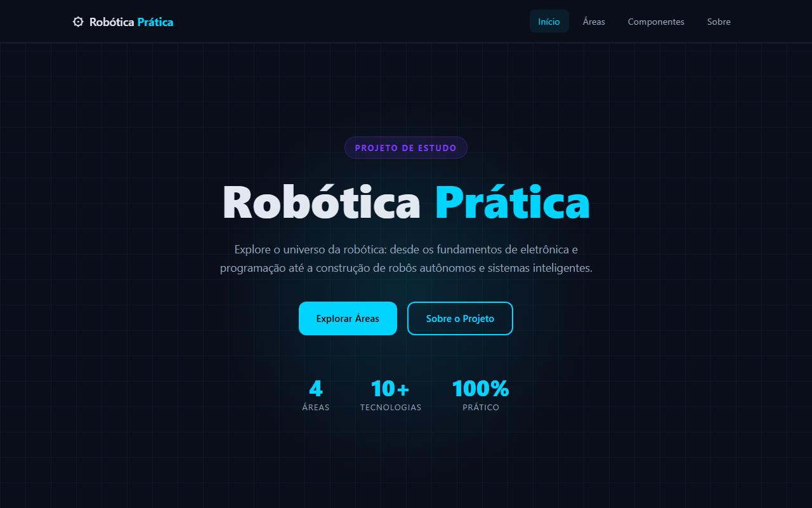

# Robótica Prática

Site estático sobre robótica — fundamentos, áreas de aplicação, componentes essenciais e roteiro de aprendizado.



## Páginas

| Página | Descrição |
|--------|-----------|
| `index.html` | Página inicial com hero, áreas e componentes |
| `sobre.html` | Sobre o projeto, tecnologias e roadmap de estudo |

## Tecnologias

- HTML5 semântico
- CSS3 com variáveis, Grid e Flexbox — tema dark neon
- JavaScript vanilla (sem dependências)
- Menu fixo com efeito de scroll (`fixedmenu.js`)
- Menu responsivo com hamburger (`responsivemenu.js`)

## Como abrir

Basta abrir `public_html/index.html` diretamente no navegador — sem servidor necessário.

## Estrutura

```
rob-tica/
└── public_html/
    ├── index.html          # Página inicial
    ├── sobre.html          # Sobre o projeto
    ├── style.css           # Estilos globais
    ├── fixedmenu.js        # Header fixo com efeito scroll
    └── responsivemenu.js   # Menu hambúrguer mobile
```
